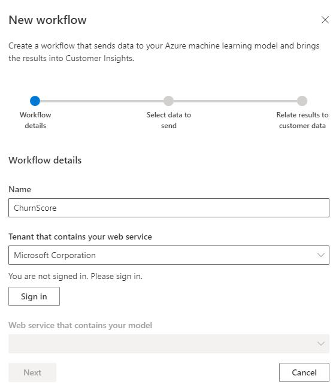

# Custom machine learning models

The **Custom Models** page lists workflows based on Azure Machine Learning models. Workflows help you choose the data you want to generate from insights and map the results to your Customer Insights data. [Read the blog about extending Customer Insights with custom models based on Azure Machine Learning](https://cloudblogs.microsoft.com/dynamics365/it/2019/10/04/extending-dynamics-365-customer-insights-with-azure-ml-based-custom-models/) and the [blog with examples of custom models](https://cloudblogs.microsoft.com/dynamics365/it/2019/10/05/examples-of-extending-dynamics-365-customer-insights-with-azure-ml/).

## Prerequisites

- To deploy a web service, you need [Azure Machine Learning Enterprise edition](https://azure.microsoft.com/pricing/details/machine-learning/).

- You need an Azure Data Lake Storage Gen2 storage account associated with your Azure Studio instance to use this feature. For more information, see [Create an Azure Data Lake Storage Gen2 storage account](https://docs.microsoft.com/azure/storage/blobs/data-lake-storage-quickstart-create-account)

## Add a new workflow

1. Go to **Intelligence** > **Custom Models** and select **New Workflow**.

1. Give your custom model a recognizable name in the **Name** field.

   > [!div class="mx-imgBorder"]
   > 

1. Select the organization that contains the web service in **Tenant that contains your web service**.

1. If your Azure Machine Learning subscription is in a different tenant than Customer Insights, select **Sign in** with your credentials for the selected organization.

1. Choose the [web service you've published using Azure Machine Learning](https://docs.microsoft.com/azure/machine-learning/studio/deploy-a-machine-learning-web-service#deploy-it-as-a-new-web-service) in the **Web service that contains your model** dropdown and select **Next**.

1. For each **Web service input**, select the matching **Entity** from Customer Insights and select **Next**.

   > [!div class="mx-imgBorder"]
   > 

1. Select the matching attribute from the **Customer ID in results** drop-down list that identifies customers in Customer Insights and select **Save**.

1. You'll see the **Workflow Saved** screen with details about the workflow you just created.

1. Select **Done**.

## Edit a workflow

1. On the **Custom Models** page, select the vertical ellipsis in the **Actions** column next to a workflow you've previously created and select **Edit**.

2. You can update your workflow's recognizable name in the **Display name** field, but you can't change the web service. Select **Next**.

3. For each **Web service input**, select the matching **Entity** from Customer Insights.  Then, select **Next**.

4. Select the matching attribute from the **Customer ID in results** drop-down list.  When you're done, select **Save**.

## Run a workflow

1. On the **Custom Models** page, select the vertical ellipsis in the **Actions** column next to a workflow you've previously created.

2. Select **Run**.

Your workflow also runs automatically with every scheduled refresh. Learn more about [setting up scheduled refreshes](pm-settings.md#schedule-tab).

## Delete a workflow

1. On the **Custom Models** page, select the vertical ellipsis in the **Actions** column next to a workflow you've previously created.

2. Select **Delete** and confirm your deletion.

Your workflow will be deleted. The [entity](pm-entities.md) that was created when you created the workflow persists, and can be viewed from the **Entities** page.
