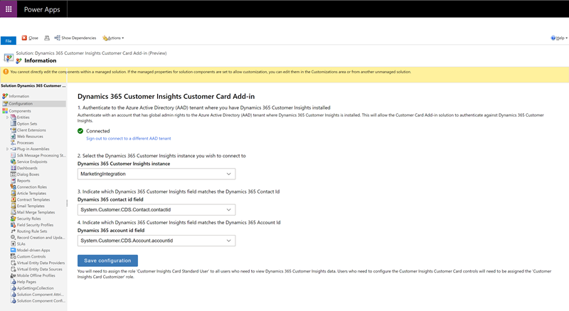

# Customer Card Add-in (preview)

Get a 360-degree view of your customers inside Dynamics 365 apps. View demographics, insights, and activity timelines with the Customer Card Add-in.

## Prerequisites

- Model-driven Dynamics 365 app (such as Sales Hub or Customer Service Hub), version 9.0 and later with Unified Interface enabled.
- Customer profiles [from the Dynamics 365 model-driven app ingested to Customer Insights using Common Data Service](pm-common-connectors.md#dynamics-365-apps-using-common-data-service).
- Users of the Customer Card Add-in need to be [added as users](permissions.md) in Customer Insights.
- [Configured search and filter capabilities](search-filter-index.md) in Customer Insights.
- Demographic control: Demographic fields, such as age or genders are available in the unified customer profile.
- Enrichment control: Requires active [enrichments](enrichment-hub.md) applied to customer profiles.
- Intelligence control: Requires data in Customer Insights generated using Azure Machine Learning ([Predictions](predictions.md) or [Custom Models](custom-models.md))
- Measure control: Requires [configured measures](measures.md) in Customer Insights.
- Timeline control: Requires [configured activities](activities.md) in Customer Insights. This control doesn't provide the same functionality as the timeline control of Dynamics 365 model-driven apps.

## Install the Customer Card Add-in

The Customer Card Add-in is a solution for Dynamics 365 model-driven apps. To install the solution, go to AppSource and search for **Dynamics Customer Card**. Select the [Customer Card Add-in on AppSource](https://appsource.microsoft.com/product/dynamics-365/mscrm.dynamics_365_customer_insights_customer_card_addin?tab=Overview) and select **Get It Now**.

You may need to sign in with your admin credentials for the Dynamics 365 model-driven app to install the solution.

It can take some time for the solution to be installed to your environment.

## Configure the Customer Card Add-in

1. As an admin, go to the **Settings** section in model-driven apps in Dynamics 365, and select **Solutions**.

1. Select the **Display Name** link for the **Dynamics 365 Customer Insights Customer Card Add-in (Preview)** solution.

   > [!div class="mx-imgBorder"]
   > 

1. Select **Sign in** and enter the credentials for the admin account you use to configure Customer Insights.

   > [!NOTE]
   > Check that the browser pop-up blocker does not block the authentication window when you select the **Sign in** button.

1. Select the Customer Insights instance you want to fetch data from.

1. Now you define which field from Customer Insights maps to a record in the Dynamics 365 app.
   - To map with a contact, select the field in the Customer Insights Customer entity that matches the ID of your contact entity.
   - To map with an account, select the field in the Customer Insights Customer entity that matches the ID of your account entity.

   > [!div class="mx-imgBorder"]
   > 

1. Select **Save configuration** to save the settings.

1. Next, you need to assign security roles in Dynamics 365 so users can customize and see the customer card. In Dynamics 365, go to **Settings** > **Security** > **Users**. Select the users to edit user roles and select **Manage roles**. Assign the following roles:

   - **Customer Insights Card Customizer**: Assign this role to users who will customize the content shown on the card for the whole organization.

## Add Customer Insights controls to forms
  
1. To add the Customer Card controls to your Contact form, go to the **Settings** > **Customizations** in Dynamics 365.

1. Select **Customize the System**.

1. Browse to the **Contact** entity, expand it and select **Forms**.

1. Select the contact form to which you want to add the Customer Card controls.

    > [!div class="mx-imgBorder"]
    > 

1. To add a control, in the form editor, drag any field from the **Field Explorer** to where you want the control to appear.

1. Select the field on the form that you just added, and select **Change Properties**.

1. Go to the **Controls** tab and select **Add Control**. Choose one of the available custom controls and select **Add**.

1. In the **Field Properties** dialog, clear the **Display label on the form** check box.

1. Select the **Web** option for the control. For the Enrichment control, select which enrichment type you want to display by configuring the **enrichmentType** field. You need to add a separate enrichment control for each enrichment type.

1. Select **Save** and **Publish** to publish the updated contact form.

1. Go to the published contact form. You'll see the newly added control. You might need to sign in the first time you use it.

1. To customize what you want to show on the custom control, select the edit button in the upper-right corner.
