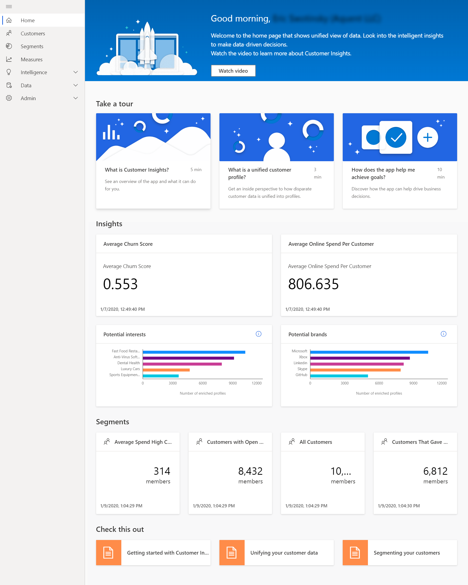

# Home

The first page you'll see in Dynamics 365 Customer Insights is **Home**. This page shows an overview of your customer base as well as metrics to track the health of your business.

> [!div class="mx-imgBorder"] 
> 

## Explore the home page

Under **Insights**, you'll see tiles with [measures](pm-measures.md). These are key performance indicators (KPIs) that you've defined, such as average likelihood of customer churn or average online spend per customer.

The **Potential interests** and **Potential brands** sections help you to gain a greater insight into your customer base by understanding the interests and brands that they have affinity for. This information can be unlocked using the [enrichment](pm-enrichment.md) capabilities, after completing the [map](pm-map.md), [match](pm-match.md), and [merge](pm-merge.md) phases.

**Segments** displays groups of customers based on demographic, behavioral, or transactional attributes that you've defined. [Creating segments](pm-segments.md) helps you to better target your business activities.

## Change between environments

Once you've set up and configured [data sources](pm-data-sources.md), you'll want to switch from a demo environment to a live environment. This allows you to work with your customers' data. Select the **Environment** control in the upper-right corner of the page to change environments.

> [!div class="mx-imgBorder"] 
> 

Administrators can create and manage [multiple environments](create-manage-environment.md). This may be useful if, for instance, your organization operates internationally and you need to segregate data and insights in varying ways to meet regulatory constraints.

## Next step

To see your own insights on the home page, you'll first need to [add data sources](pm-data-sources.md). Then, [unify](pm-configure-data.md) your data to build customer profiles,  and [enrich](pm-enrichment.md) these to unlock a wider range of insights related to brand and interest affinities.
