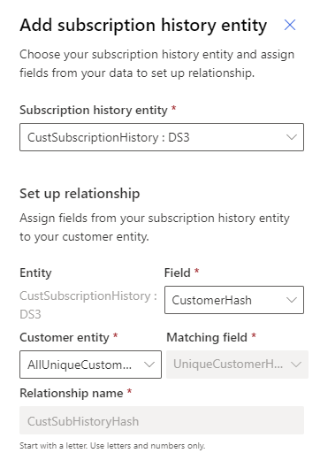
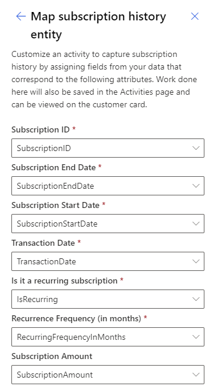
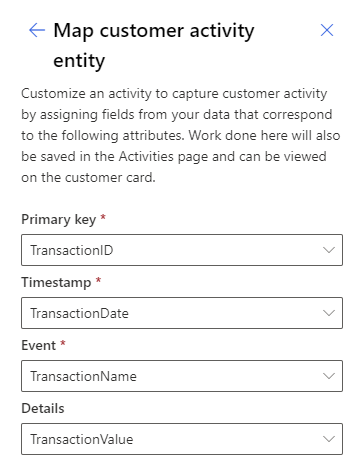
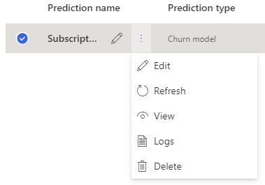
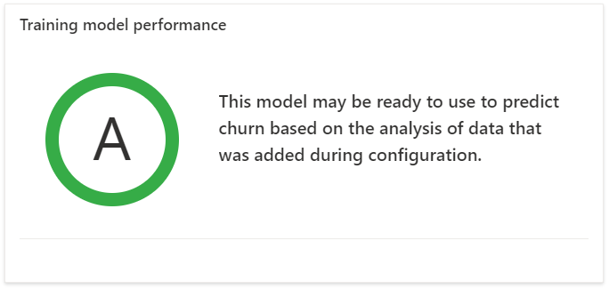
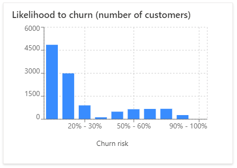

# Subscription Churn

Subscription churn prediction helps predicting whether a customer is at risk for no longer using your company’s subscription products or services. You can create new subscription churn predictions on the **Intelligence** > **Predictions** page. Select **My predictions** to see other predictions that you have created.

## Prerequisites

1. To create a prediction, you need at least Contributor permissions in Customer Insights.
1. To create a subscription churn prediction, we need data about your subscriptions and their history:
    - Subscription identifiers to distinguish subscriptions.
    - Customer identifiers to match subscriptions to your customers.
    - Subscription event dates, which define start dates, end dates, and the dates the subscription events occurred on.
    - Subscription information to define if it's a recurring subscription and how often it renews.
    - The semantic data schema for subscriptions requires the following information:
        - **Subscription ID:** A unique identifier of a subscription.
        - **Subscription End Date:** The date the subscription expires for the customer.
        - **Subscription Start Date:** The date the subscription starts for the customer.
        - **Transaction Date:** The date a subscription change happened. For example, a customer buying or canceling a subscription.
        - **Is it a recurring subscription:** A boolean true/false field that determines if the subscription will renew with the same subscription ID without customer intervention
        - **Recurrence Frequency (in months):** For recurring subscriptions, it's the period the subscription will renew for. It's represented in months. For example, a yearly subscription that automatically renews for a customer every year for another year has the value 12.
        - (Optional) **Subscription Amount:** The amount of currency a customer pays for the subscription renewal. It can help identify patterns for different levels of subscriptions.
1. Additionally, we need some data about customer activities:
    - Activity identifiers to distinguish activities of the same type.
    - Customer identifiers to map activities to your customers.
    - Activity information containing the name and date of the activity.
    - The semantic data schema for customer activities includes:
        - **Primary key:** A unique identifier for an activity. For example, a website visit or a usage record showing the customer viewed a television show episode.
        - **Timestamp:** The date and time of the event identified by the primary key.
        - **Event:** The name of the event you want to use. For example, a field called "UserAction" in a streaming video service could have the value of "Viewed".
        - **Details:** Detailed information about the event. For example, a field called "ShowTitle" in a streaming video service could have the value of a video a customer watched.
1. Business knowledge to understand what churn means for your business. We support time-based churn definitions, meaning a customer is considered to have churned a period of time after their subscription is ended.

## Create a Subscription Churn prediction

1. In Customer Insights, go to **Intelligence** > **Predictions**.
1. Select the **Subscription churn model (preview)** tile and select **Use this model**.
   > [!div class="mx-imgBorder"]
   > 
1. Provide a name for the model to distinguish it from other models.
1. Provide a name for the output entity. That's the name that the model entity will use. Include letters and numbers only, without any spaces and select **Next**.
1. Enter the number of days from a subscription end date that your business considers a customer to be in a churned state. This period is typically liked to business activities like offers or other marketing efforts trying to prevent losing the customer. Then, select **Next**.
   >[!TIP]
   > You can select **Save and close** at any time to save the prediction as a draft. You'll find the draft prediction in the **My predictions** tab to continue.
1. Select **Add data** for **Subscription history** and choose the entity that provides the subscription history information as described in the [prerequisites](#prerequisites).
1. If the fields below aren't populated, configure the relationship from your subscription history entity to the Customer entity.
    1. Select the field that identifies the customer in the subscription history table, which is related to the primary customer ID of your Customer entity.
    1. Select the Customer entity that matches your primary Customer entity
    1. Enter a name that describes the relationship. For example, Entityname1Entityname2ID where Entityname1 is the name of your first entity, and Entityname2 the name of your second entity.
       > [!div class="mx-imgBorder"]
       > 
1. Select **Next**.
1. Map the semantic fields to attributes within your subscription history entity and select **Save**. For descriptions of the fields, have a look at the [prerequisites](#prerequisites).
   > [!div class="mx-imgBorder"]
   > 
1. Select **Add data** for **Customer activities** and choose the entity that provides the customer activity information as described in the prerequisites.
1. Select an activity type that matches to the type of customer activity you are configuring.  If you don't see an option that matches to the activity type you need, select **Create new** and provide the name of the activity type.
1. If the fields below are not populated, you'll need to configure the relationship from your customer activity entity to the Customer entity.
    1. Select the field that identifies the customer in the customer activity table, which can be directly related to the primary customer ID of your Customer entity.
    1. Select the Customer entity that matches your primary Customer entity
    1. Enter a name that describes the relationship. For example, Entityname1Entityname2ID where Entityname1 is the name of your first entity, and Entityname2 the name of your second entity.
1. Select **Next**.
1. Map the semantic fields to attributes within your customer activity entity and select **Save**. For descriptions of the fields, have a look at the [prerequisites](#prerequisites).
1. (Optional) If you have any other customer activities you would like to include, repeat the steps above.
   > [!div class="mx-imgBorder"]
   > 
1. Select **Next**.
1. Set a frequency to retrain your model. This setting is important to update the accuracy of predictions as new data is imported into Customer Insights. Most businesses can retrain once per month and retain good accuracy for their prediction.
1. Select **Next**.
1. Review the configuration. You can navigate back to any part of the prediction configuration from this page by selecting **Edit** under the shown value. Alternatively, you can select a configuration step from the progress indicator.
1. If all values are configured correctly, select **Save and run** to begin the prediction process. On the **My predictions** tab, you can see the status of your predictions. The process may take several hours to complete depending on the amount of data used in the prediction.

## Reviewing a prediction status and results

1. Go to the **My predictions** tab on **Intelligence** > **Predictions**.
   > [!div class="mx-imgBorder"]
   > 
1. Select the prediction you want to review.
   - **Prediction name:** The name of the prediction provided when creating it.
   - **Prediction type:** The type of model used for the prediction
   - **Output entity:** Name of the entity to store the output of the prediction. You can find an entity with this name on **Data** > **Entities**.
   - **Predicted field:** This field is populated only for some types of predictions, and is not used in subscription churn prediction.
   - **Status:** The current status of the prediction's run.
        - **Queued:** The prediction is currently waiting for other processes to run.
        - **Refreshing:** The prediction is currently running the "score" stage of processing to produce results that will flow into the output entity.
        - **Failed:** the prediction has failed. Select **Logs** for more details.
        - **Succeeded:** the prediction has succeeded. Select **View** under the vertical ellipses to review the prediction
   - **Edited:** The date the configuration for the prediction was changed.
   - **Last refreshed:** The date the prediction refreshed results in the output entity.
1. Select the vertical ellipses next to the prediction you want to review results for and select **View**.
   > [!div class="mx-imgBorder"]
   > 
1. There are three primary sections of data within the results page:
    1. **Training model performance:** A, B, or C are possible scores. This score indicates the performance of the prediction, and can help you make the decision to use the results stored in the Output entity.
        - Scores are determined as A, B, or C based on the following rules:
            - **A** = If the percentage of users we predicted churn for in a sample set of data were accurately predicted is greater than the 10% above the average churn rate.
            - **B** = If the percentage of users we predicted churn for in a sample set of data were accurately predicted is greater than 0% and less than 10% of average churn rate.
            - **C** = If the percentage of users we predicted churn for in a sample set of data were accurately predicted is less than the average churn rate.
               > [!div class="mx-imgBorder"]
               > 
    2. **Likelihood to churn (number of customers):** Groups of customers based on their predicted risk of churn. This data can help you later if you want to create a segment of customers with high churn risk to understand where your cutoff should be for segment membership.
       > [!div class="mx-imgBorder"]
       > 
    3. **Most influential factors:** There are many factors that are taken into account when creating your prediction.  Each of the factors has their importance calculated for the predictions a model creates in aggregate.  You can use these factors to help validate your prediction results, and can use this information later to also begin to create segments that could help influence churn risk for customers.
       > [!div class="mx-imgBorder"]
       > 

## Fix a failed prediction

1. Go to the **My predictions** tab on **Intelligence** > **Predictions**.
1. Select the vertical ellipses next to the prediction you would like to view error logs for and select **Logs**.
   > [!div class="mx-imgBorder"]
   > 
1. Review all the errors. There are several types of errors that can occur, and they describe what condition caused the error. For example, an error noting there was not enough data to accurately predict can typically be resolved by loading additional data into Customer Insights.

## Refresh a prediction

Predictions will automatically refresh on the same [schedule your data refreshes](pm-settings.md#schedule-tab) as configured in settings.

1. Go to the **My predictions** tab on **Intelligence** > **Predictions**.
1. Select the vertical ellipses next to the prediction you want to refresh.
1. Select **Refresh**.

## Delete a prediction

1. Go to the **My predictions** tab on **Intelligence** > **Predictions**.
1. Select the vertical ellipses next to the prediction you want to delete.
1. Select **Delete**.

> [!NOTE]
> Deleting a prediction will not remove its output entity.
