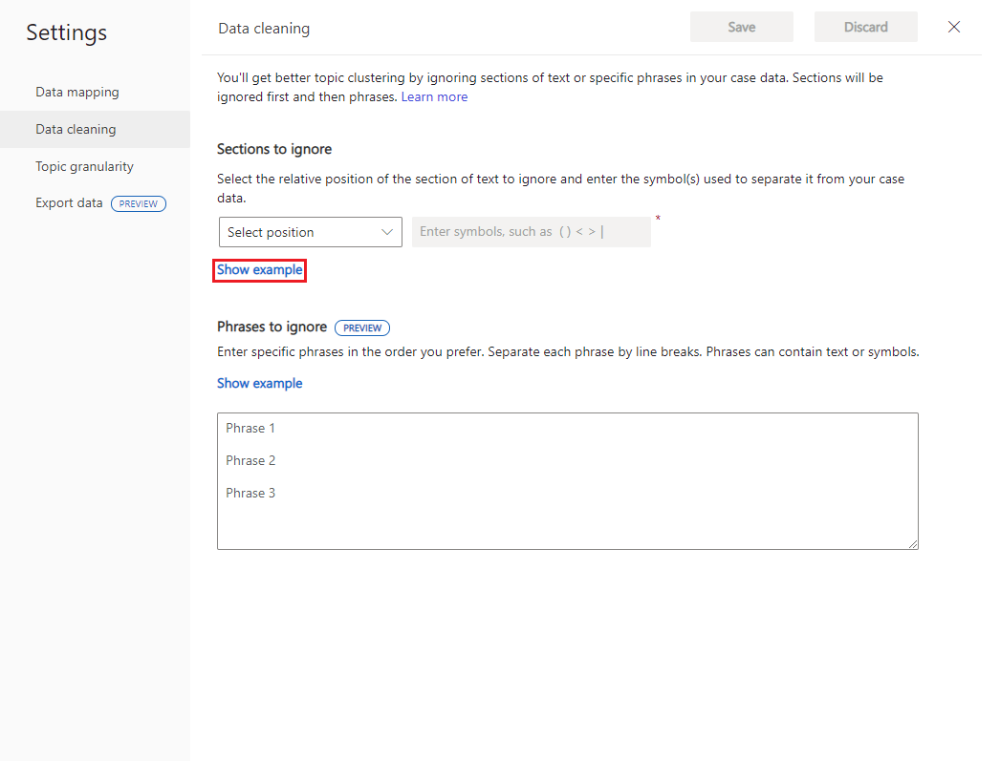
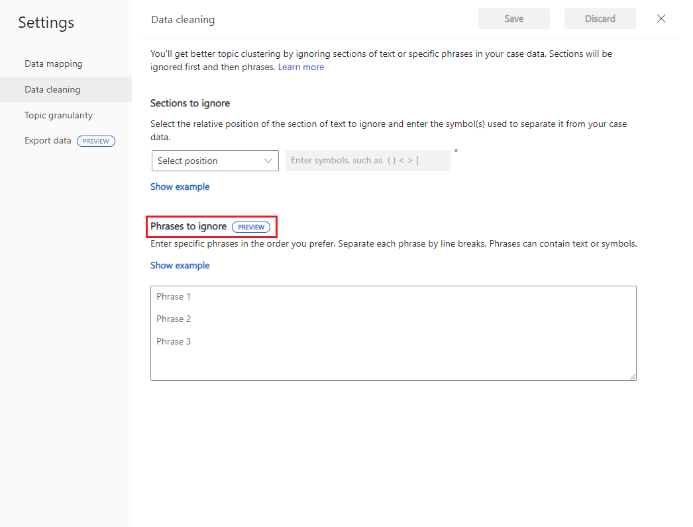
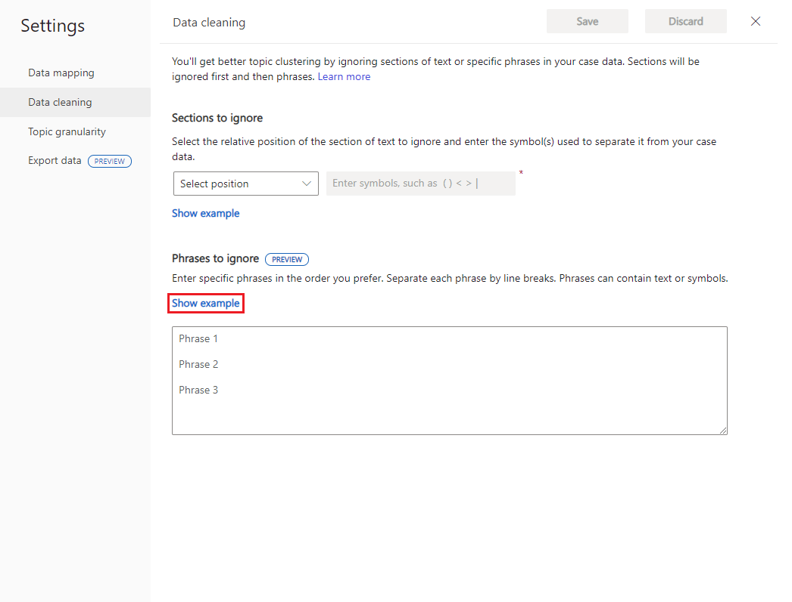

# Improve data quality by cleaning support case data

Customer Service Insights uses artificial intelligence technology to give you insights into your customer service data by grouping support cases as *topics* that are a collection of related cases. This can help you identify areas for improvement that can have the greatest impact on system performance.

The AI Insights charts displayed on the Customer Service Insights dashboards are generated by applying language understanding technology to the titles of support cases. However, the results can be misleading if the titles include extraneous information such as product name, case status, or ticket number tags. You can improve the quality of the results displayed in AI Insights charts by specifying Data Cleaning settings to disregard tags in titles when they are grouped into topics, as well as specific phrases that should be ignored. Note that when you choose to apply both options, sections are ignored first, followed by phrases.

**Note**: The **Phrases to ignore** feature is a preview release and is subject to change in future releases.

## To clean support case data

1. Select the **Settings** button on the Customer Service Insights title bar, and then select **Data cleaning**.

   > [!div class="mx-imgBorder"]
   > 

   Customer Service Insights displays the **Data cleaning** page.

   > [!div class="mx-imgBorder"]
   > 
   

2. If your case data includes tags, under **Sections to ignore**, use the drop-down menu to specify where you put them and any punctuation marks you use to separate them. 

   (Need screen with drop-down menu - cannot see in sample data)

   To see an example of how the cleaning settings will be applied to titles, select **Show example**.

   
   > [!div class="mx-imgBorder"]
   > 
   

3. Under **Phrases to ignore (Preview)**, specify the phrases you want ignored. 
  Keep in mind the following:
  - Phrases are not case-sensitive and can contain letters or symbols.

  - Spaces can be included between letters and symbols, but spaces at the beginning or ending of a phrase will be trimmed. 

  - Phrases can have up to 200 characters, and each phrase must be separated by a line break.
 
  - You can specify up to 100 phrases to ignore.

  > [!div class="mx-imgBorder"]
  > 
   

   For text examples, click **Show example**.
   
  > [!div class="mx-imgBorder"]
  > 
   
   

4. When you are through entering your conditions, select **Save**.

   [!div class="mx-imgBorder"]
   
   
   
5. Customer Service Insights gives you the option of refreshing your workspace. The settings take effect when you refresh the workspace. Select **Refresh** to refresh the workspace.

   

Check the results generated by the AI Insights charts, and fine-tune your **Data cleaning** settings as necessary.
