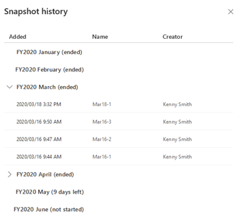
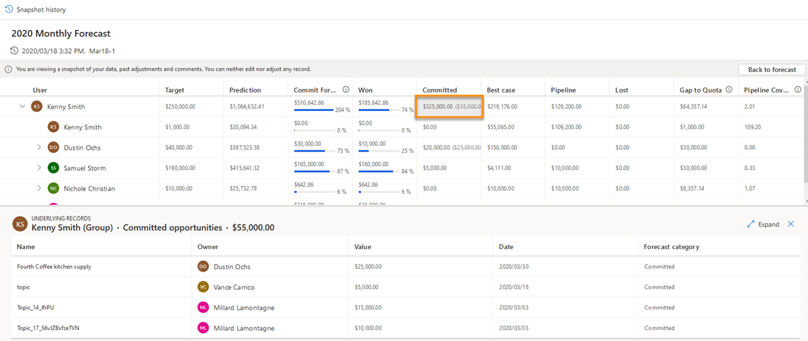

# View snapshots

Viewing a snapshot allows you to see and understand the data of the forecast at the moment in time when it's taken including the underlying opportunities. Also, you can compare and understand the data between your current forecast and snapshot on how the forecast is doing. 

**To view snapshots**

1.	Sign in to the Sales Hub app and go to **Performance** > **Forecasts**.

2.	Select the forecast for which you want to view the snapshots.

3.	Select **Snapshot history**. 

    > [!div class="mx-imgBorder"]
    > 

    A list of snapshot that is available for the selected forecast is displayed in the **Snapshot history** pane.
    
    > [!div class="mx-imgBorder"]
    > 

4.	Select a snapshot to view. In this example, we're selecting **Mar18-1** snapshot and displayed as shown in the following image:

    > [!div class="mx-imgBorder"]
    > 

    >[!NOTE]
    >The data displayed in the snapshot is view only and can't be modified.

    You can select a column and see the underlying opportunities that are defining the value of the column at that point in time. For example, we're selecting Kenny Smith's Committed column and the underlying opportunities that are contributing the value in the **Committed** column at that point in time are displayed.
    
    > [!div class="mx-imgBorder"]
    > 

5.	To go back to the forecast, select **Back to forecast**.

### See also

[About premium forecasting](configure-premium-forecasting.md) 
[Manage snapshots for a forecast](manage-snapshots-forecast.md) 
[Analyze deals flow between snapshots](analyze-deals-flow-between-snapshots.md)